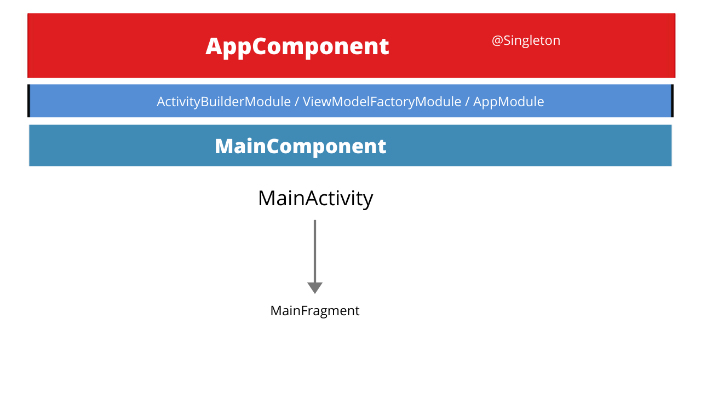

# All Components working Together 

   

# This is one page News App using News Api (https://newsapi.org)

   

# Very Simple Dagger Architecture used in App

   

# Components Used in App

<b>1) MVVM Arhitecture</b>

MVVM is one of the architectural patterns which enhances separation of concerns, it allows separating the user interface
logic from the business (or the back-end) logic. Its target (with other MVC patterns goal) is to achieve
the following principle “Keeping UI code simple and free of app logic in order to make it easier to manage”.

<b>2) Kotlin </b>

Kotlin is a programming language that can run on JVM. Google has announced Kotlin as one of its officially supported programming languages in Android ...

<b>3) Dagger 2 </b>

From the documentation:
By using dependency injection framework, each class is easy to test. You don't need a bunch of boilerplate just to swap the RpcCreditCardService out for a FakeCreditCardService.
Dependency injection isn't just for testing. It also makes it easy to create reusable, interchangeable modules. 
You can share the same AuthenticationModule across all of your apps. And you can run DevLoggingModule during development
and ProdLoggingModule in production to get the right behavior in each situation.

<b>4) Timber </b>

Timber is used for better logging in Android. As an Android developer, we use a lot of Log statement 
in our project to generate outputs and we can use it to check if the required output is printed in Terminal or not.

<b>5) Glide </b>

Glide is a fast and efficient image loading library for Android focused on smooth scrolling. Glide offers an easy to use API, a performant and extensible resource decoding pipeline and automatic resource pooling.

<b>6) Retrofit </b>

Retrofit is a type-safe REST client for Android, Java and Kotlin developed by Square. The library provides 
a powerful framework for authenticating and interacting with APIs and sending network requests with OkHttp. 

<b>7) GSON Convertor </b>

A Converter which uses Gson for serialization to and from JSON.
A default Gson instance will be created or one can be configured and passed to the GsonConverterFactory to further control the serialization.

<b>8) RxJava and Reactive Programming</b>

So let’s begin by providing a definition of Reactive Programming:
Reactive Programming is a programming paradigm oriented around data flows and the propagation of change i.e. it is all about responding to value changes. For example, let’s say we define x = y+z. When we change the value of y or z, the value of x automatically changes. This can be done by observing the values of y and z.
Reactive Extensions is a library that follows Reactive Programming principles to compose asynchronous and event-based programs by using observable sequence.
RxJava is a Java based implementation of Reactive Programming.
RxAndroid is specific to Android platform which utilises some classes on top of the RxJava library.

<b>9) RecyclerView  </b>

Overview
The RecyclerView is a ViewGroup that renders any adapter-based view in a similar way. It is supposed to be the successor of ListView and GridView. One of the reasons is that RecyclerView has a more extensible framework, especially since it provides the ability to implement both horizontal and vertical layouts. Use the RecyclerView widget when you have data collections whose elements change at runtime based on user action or network events.

<b>10) Navigation component  </b>

The Navigation component is a library that can manage complex navigation, transition animation, deep linking, 
and compile-time checked argument passing between the screens in your app.

# Thanks for Reading
<i> I will using more android components that can be used together. Thanks for Reading 
<b> I am current looking for oppurtunity in Android. Email prakashshukla1820@gmail.com </b>
